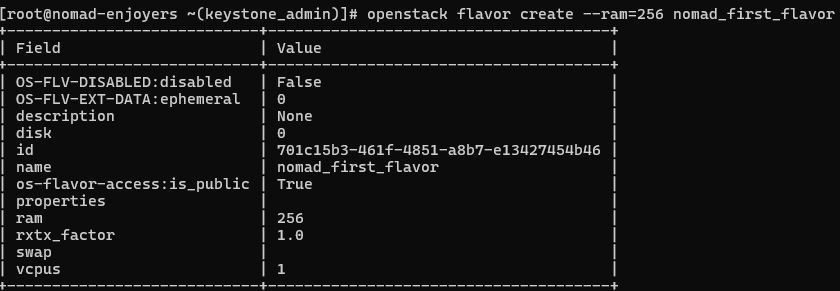

University: [ITMO University](https://itmo.ru/ru/)  \
Faculty: [FICT](https://fict.itmo.ru) \
Year: 2023/2024 \
Group:

- Заглубоцкий Артём
- Доронин Дмитрий
- Мигулаева Татьяна
- Ишутина Елизавета

# Лабораторная работа №2 "Создание ВМ"

## Содержание

- [Ход работы](#ход-работы)
  - [Публичные и приватные сети Neutron](#публичные-и-приватные-сети-neutron) 
  - [Флейвор Glance](#флейвор-glance)
  - [Блочное устройство Cinder](#блочное-устройство-cinder)
  - [Рабочий инстанс Nova](#рабочий-инстанс-nova)
- [Выполнение задания](#выполнение-задания)
  - [Задание](#задание)
  - [Создание приватной сети](#1-создание-приватной-сети-через-horizon)
  - [Создание копии блочного устройства](#2-создание-копии-блочного-устройства)
  - [Создание виртуальной машины](#3-создание-виртуальной-машины)
- [Ответы на вопросы](#ответы-на-вопросы)

## Ход работы

### Публичные и приватные сети Neutron

Создание сети провайдера:

Создание подсети в сети провайдера:

Создание приватной сети и подсети:

Создание роутера:

### Флейвор Glance

Flavor в Openstack используется для того, чтобы определить вычислительную мощность, объем памяти и размер хранилища для инстанса Nova. \
Создание флейвора виртуальной машины: \

### Ключ доступа

Создание ключа доступа для обеспечения возможности подключения без использования пароля:

### Блочное устройство Cinder

Установка образа Cirros:

Создание блочного устройства из образа: \

### Рабочий инстанс Nova

Для создания рабочего инстанса необходимо перейти в `Вычислительные ресурсы->Инстансы`. Далее нажать на кнопку запустить инстанс, после чего появится диалоговое окно для настройки конфигурации. После того, как будут выбраны все параметры, запрос на создание виртуальной машины будет отправлен в Nova.

Проверка IP-адреса виртуальной машины:

## Выполнение задания

### Задание

1. Через Horizon создать еще одну приватную сеть+подсеть (адресация любая), подключить ее к уже существующему роутеру
2. Через Openstack CLI сделать копию ранее созданного блочного устройства
3. Через Openstack CLI создать еще одну ВМ (`openstack server create...`). Параметры машины:
    - имя произвольное
    - источник: созданная копия диска
    - флейвор: созданный ранее (можно другой, если позволяют ресурсы ВМ)
    - сеть: новосозданная приватная
4. Через Horizon проверить, что все завелось

### 1. Создание приватной сети через Horizon

Для создания новой сети необходимо перейти в `Сеть->Сети` и нажать на кнопку создать сеть. После этого появится диалоговое окно, в котором можно настроить создание приватной сети, подсети, а также добавить детали для создания.

В результате, в той же вкладке отобразится созданная сеть.

### 2. Создание копии блочного устройства

Команда `openstack create volume` поддерживает несколько источников создания дисков: image(--image), snapshot(--snapshot), volume(--source).

Для создании из копии ранее созданного блочного устройства было использована два способа: snapshot и volume.

Создание из snapshot: \

Создание из volume: \

### 3. Создание виртуальной машины

Для создания виртуальной машины использовались следующие аргументы: `--flavor`, `--volume`, `--network`, `--key-name`. \
В итоге, создание полная команда выглядела следующим образом:

Проверка созданного инстанса:

Проверка установленного IP-адреса:

## Ответы на вопросы

> Что именно сервис с помощью Keystone проверяет в токене пользователя, когда тот пытается осуществить операцию по отношению к этому сервису?

Сервисы проверяют в Keystone две информации: корректный ли токен и разрешено ли использование сервиса.

> При создании ВМ, Nova первым делом идет в Keystone, проверяет токен и т.д. Как думаете, к эндпоинту какого сервиса Nova идет следом?

После того, как Nova проверит токен, следующим запросом является проверка наличии конфликтов с `nova-database` и при их отсутсвии создает начальную запись в базе данных для нового инстанса. Однако следующим запросом в другой сервис, является запрос в Glance для получения образа вм.    
