University: [ITMO University](https://itmo.ru/ru/)  \
Faculty: [FICT](https://fict.itmo.ru) \
Year: 2023/2024 \
Group:

- Заглубоцкий Артём
- Доронин Дмитрий
- Мигулаева Татьяна
- Ишутина Елизавета

# Лабораторная работа №3 "Работа с Openstack API"

## Содержание

- [Ход работы](#ход-работы)
  - [Проброс портов](#проброс-портов) 
  - [Запрос токена из Keystone](#запрос-токена-из-keystone) 
  - [Проверка токена](#проверка-токена) 
  - [Создание ВМ](#создание-вм) 
    - [Получение id образа](#получение-id-образа) 
    - [Получение flavor](#получение-flavor) 
    - [Создание ВМ](#создание-вм) 
    - [Проверка ВМ](#проверка-вм) 
- [Выполнение задания](#выполнение-задания)
  - [Задание](#задание)
- [Ответы на вопросы](#ответы-на-вопросы)

## Ход работы

### Проброс портов

Проброс нужных портов:
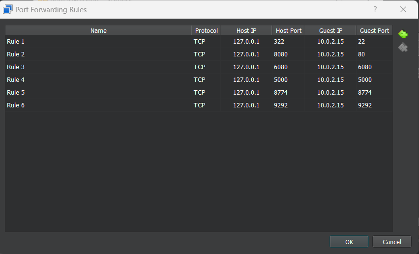

### Запрос токена из Keystone

К адресу keystone `http://localhost:5000/v3/auth/tokens` выполняется запрос с данными авторизации в теле запроса в формате json.:
```json
{
    "auth": {
        "identity": {
            "methods": ["password"],
            "password": {
                "user": {
                    "name": "admin",
                    "domain": {"id": "default"},
                    "password": "642342bf62c244f1"
                }
            }
        },
        "scope": {
            "project": {
                "name": "admin",
                "domain": {"id": "default"}
            }
        }
    }
}
```
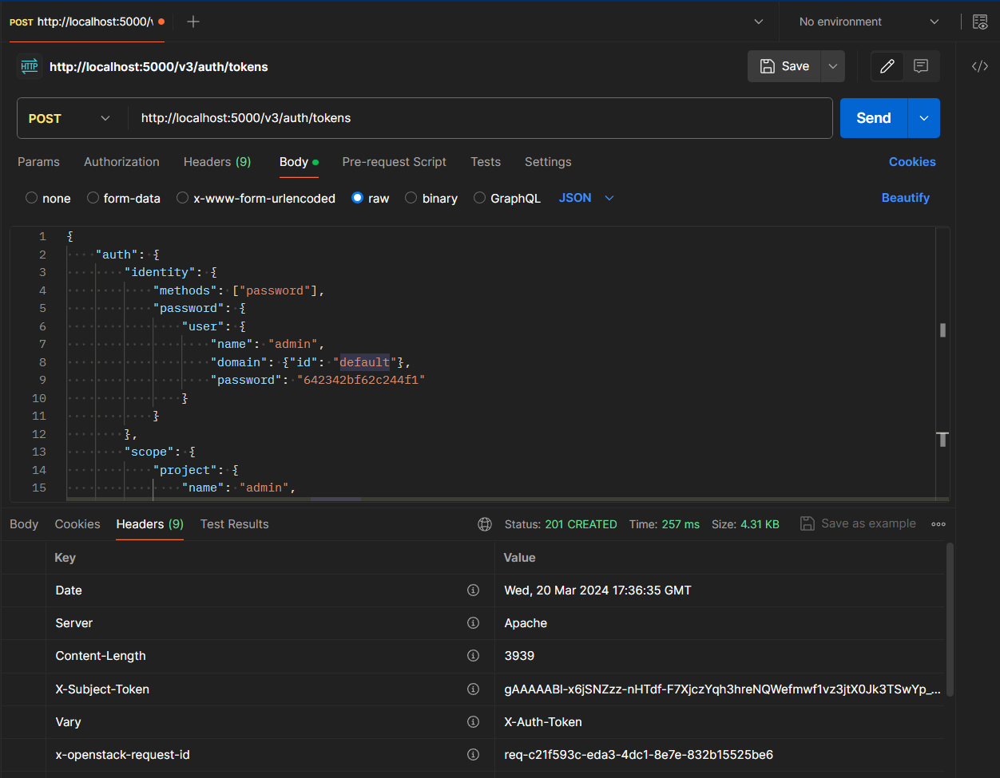

### Проверка токена

Для проверки токена делается запрос `GET` к `http://localhost:8774/v2.1/servers` с полученным токеном в загаловках `X-Auth-Token` и `X-Subject-Token`:
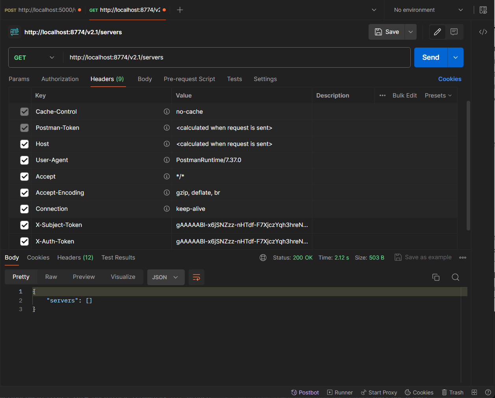

### Создание ВМ

Для создания ВМ делается `POST` запрос к  `http://localhost:8774/v2.1/servers` с полученным токеном в загаловках `X-Auth-Token` и `X-Subject-Token` и параметрами ВМ в теле запроса. Чтобы создать вм нужно как минимум получить ID образа, прописать flavor (конфигурацию), а также прописать настройки сети. В данном случае была выбрана сеть, созданная в ЛР №2:

##### Получение id образа
Используется `GET` запрос к `http://localhost:9292/v2/images` с установлеными заголовками авторизации по токену.
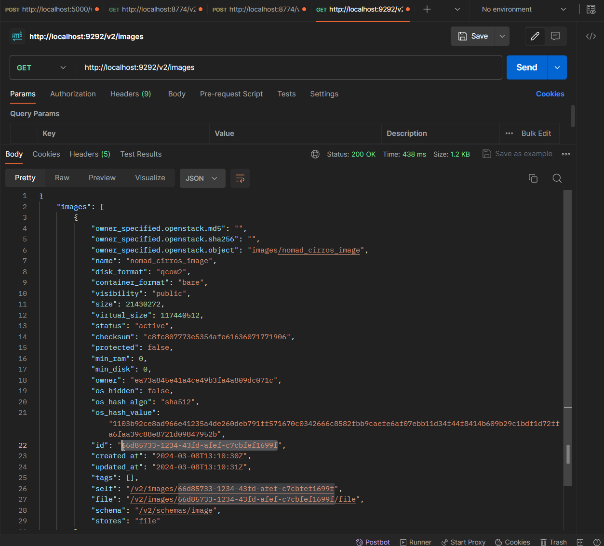

##### Получение flavor образа
Получение списка flavor запросом `GET` по ссылке `http://localhost:8774/v2.1/flavors`.
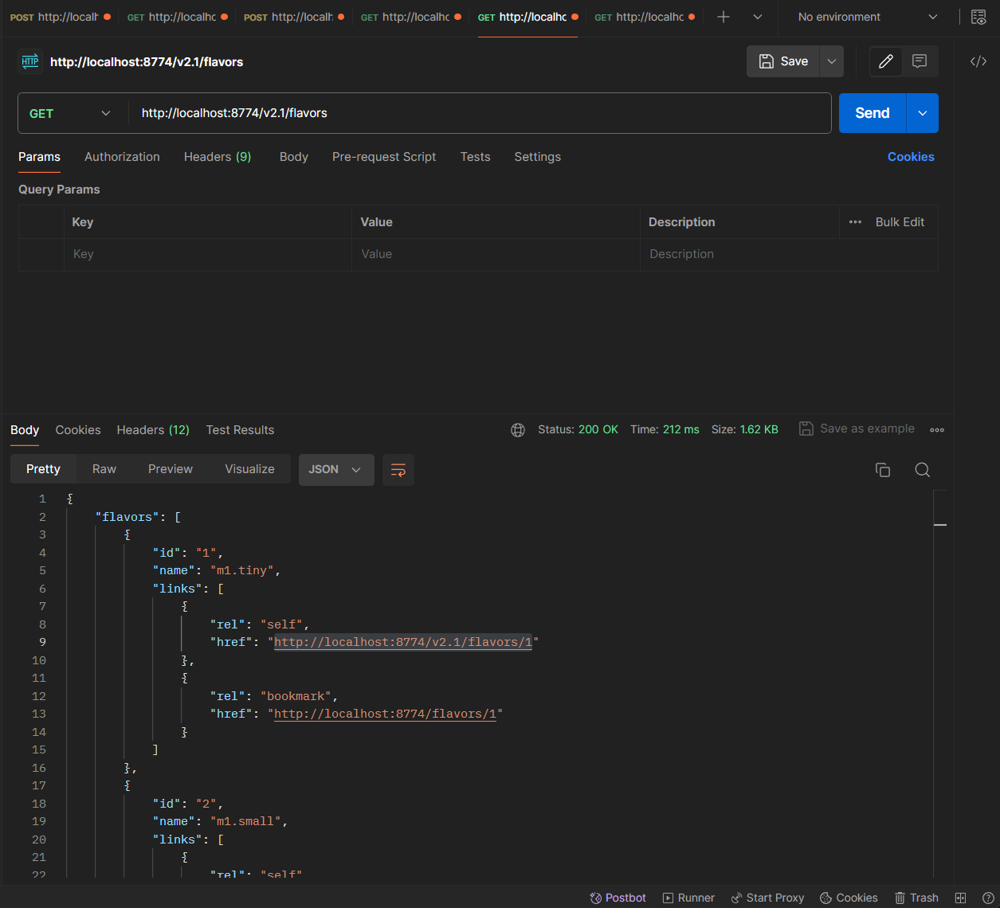

Получение tiny flavor запросом `GET` по ссылке `http://localhost:8774/v2.1/flavors/1`.
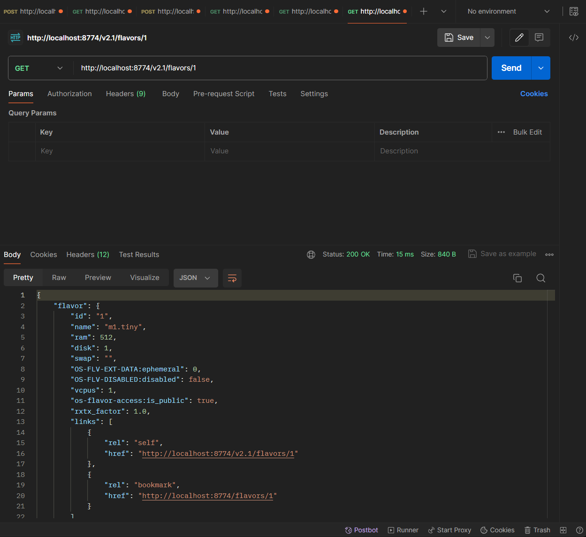

##### Создание вм
```json
{
    "server": {
        "name": "nomajEnjoyer",
        "imageRef": "66d85733-1234-43fd-afef-c7cbfef1699f",
        "flavorRef": "1",
        "networks": [
            {
                "uuid": "18edcf42-e172-4d32-a5d1-c6231376f59d"
            }
        ]
    }
}
```
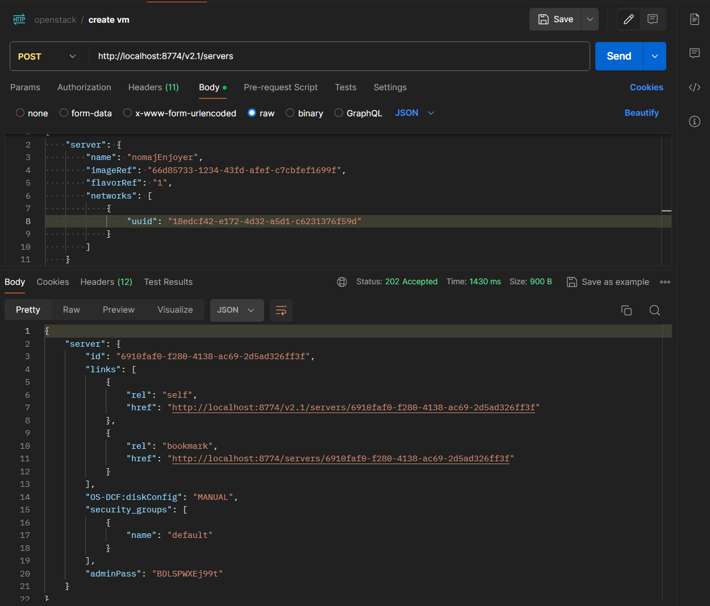

##### Проверка вм
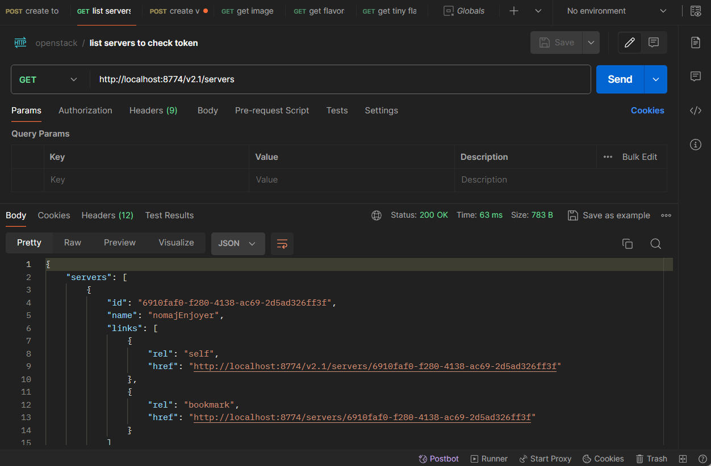
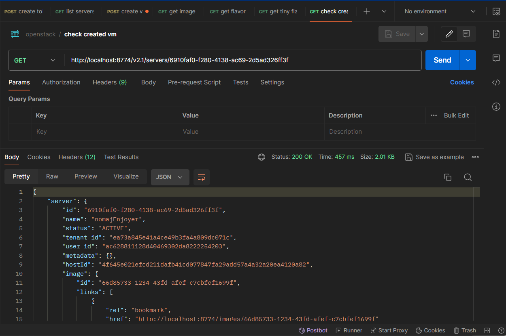

## Выполнение задания

### Задание

В качестве креативного решения был создан мод для Minecraft версии 1.16.5, который позволяет аутентифицироваться в Keystone используя чат игры.

https://github.com/ch4t5ky/2023_2024-openstack-teamwork/assets/28315102/7d855930-a67d-4d61-a8b0-cac974b8615e

После того, как на токен был получен, можно создать виртуальную машину. В качестве аватара в игре используется свинья, имя которое совпадает с именем виртуальной машины, а также в ее информации хранится идентификатор виртуальной машины.

https://github.com/ch4t5ky/2023_2024-openstack-teamwork/assets/28315102/a57a9a45-96ee-4495-a492-ca44840e4ffb

В результате можно увидеть созданные виртуальные машины в Horizon.
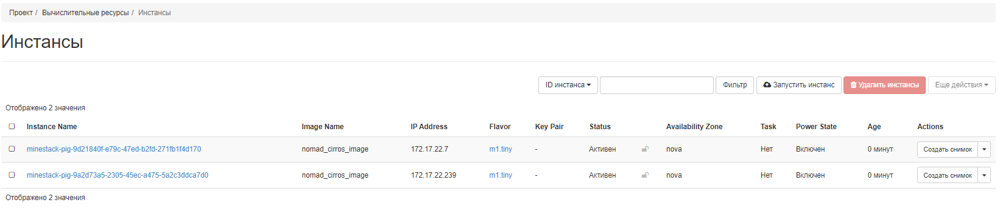

Если свинья погибает от руки игрока, событие перехватывается и получает из сущности идентификатор виртуальной машины, после чего отправляет запрос в Nova на удаление. 

https://github.com/ch4t5ky/2023_2024-openstack-teamwork/assets/28315102/8d08284c-47b0-41b9-96c3-017ffcbf7093

В результате, в Horizon остался только один инстанс.
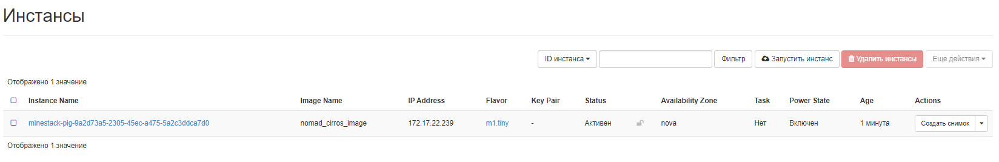

Исходный код представлен в репозитории [minestack](https://github.com/ch4t5ky/minestack).

## Ответы на вопросы

> Какие протоколы тунеллирования использует Neutron?


- VXLAN (Virtual Extensible LAN): VXLAN инкапсулирует Ethernet-фреймы в UDP-пакеты и использует 24-битный идентификатор сегмента (VXLAN Network Identifier, VNI) для разделения трафика между виртуальными сетями. VXLAN предназначен для обеспечения масштабируемой сетевой изоляции и позволяет оверлейной сети 2-го уровня распространяться по нескольким доменам сети 3-го уровня.
- GRE (Generic Routing Encapsulation): GRE инкапсулирует пакеты сетевого уровня OSI в IP-пакеты. Он использует поле ключа для идентификации виртуальных сетей. GRE работает путем инкапсуляции полезной нагрузки и создает частное соединение "точка-точка". В отличие от VXLAN и Geneve, GRE не использует UDP в качестве транспортного протокола.
- Geneve (Generic Network Virtualization Encapsulation): Geneve - это гибкий и расширяемый протокол туннелирования, который инкапсулирует Ethernet-фреймы в UDP-пакеты, как и VXLAN. Однако Geneve предоставляет гибкую структуру для туннелирования и адаптируется к различным сценариям виртуализации, поддерживая расширяемые опциональные заголовки. Geneve поддерживает unicast, multicast и broadcast.

> Можно ли заменить Cinder, например, CEPH-ом? Для чего если да, почему если нет?

Cinder - это компонент OpenStack для предоставления блочного хранилища (томов) виртуальным машинам. Ceph - это распределенная система хранения с открытым исходным кодом, которая обеспечивает высокую производительность, надежность и масштабируемость. Можно использовать Ceph в качестве бэкенда для Cinder, заменяя стандартный локальный бэкенд хранилища. В таком случае Cinder будет работать поверх Ceph, предоставляя блочное хранилище виртуальным машинам. Преимущества использования Ceph как бэкенда для Cinder включают:
- Масштабируемость: Ceph позволяет легко масштабировать хранилище путем добавления новых узлов в кластер.
- Надежность: Ceph обеспечивает репликацию данных и автоматическое восстановление при сбоях, повышая надежность хранилища.
- Производительность: Ceph распределяет данные по множеству узлов, обеспечивая высокую производительность и параллельный доступ к данным.
Кроме того можно использовать Ceph как бэкенд для других сервисов, так-как Ceph также предоставляет собственный интерфейс блочного хранилища RADOS, который можно использовать напрямую для загрузки виртуальных машин без использования Cinder. В этом случае виртуальные машины будут загружаться непосредственно из Ceph, минуя уровень абстракции Cinder. 
